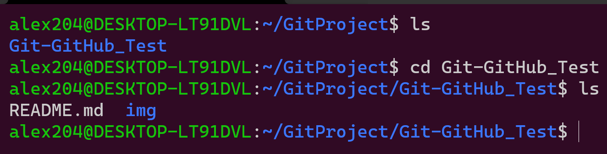
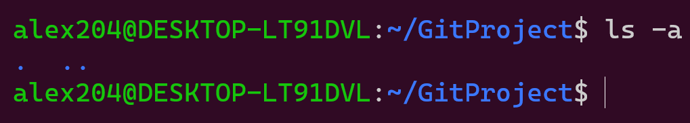

# <보고서>

## GFM

- 과제 제출을 위한 GitHub Repository 링크
> Link : [GitHub Repository](https://github.com/alex204301/Git-GitHub_Test "GitHub Repository")

 

---

## add

- 사용 시나리오
  1. 현재 untracked 상태인 마크다운 파일이 있다.
    
  3. 이 파일을 staged 상태로 만들고 싶다.
  4. 이를 위해 이 명령어 사용했다.
    
   
- 명령어 설명
  - `$ git add <filename>`: 수정했거나 새로 만든 파일을 staged 상태로 만든다.
  - staged 상태가 된 파일들은 **인덱스**에 저장된다.
- 유용한 옵션들
  | Options | Description |
  | ------- | :---------- |
  | `-u` | 이전에 commit한적이 있는 파일만 add 한다. |
  | `-p` | 각 변경사항을 터미널에서 확인하면서 부분적으로 파일들을 add할 수 있다. |
  | `-A` | 작업 디렉토리의 모든 변경사항을 add한다.|

 

---

## branch

- 사용 시나리오
  1. 현재 상태
  2. ~상태로 만들고 싶다
  3. 이를 위해 이 명령어 사용했다.
  4. 그 결과
   
- 명령어 설명
  - branch를 관리하는 명령어
  - `$ git branch`: 로컬 branch 목록을 보여준다.
  - 이 명령어로 branch를 만들다고 `HEAD`가 이동하는 것은 아니다.
  
- 유용한 옵션들
  | Options | Description |
  | ------- | :---------- |
  | `-a` | 원격 branch를 포함한 모든 branch 목록을 보여준다. |
  | `-d <branch_name>` | 해당 branch를 삭제한다. |
  | `-m <old> <new>` | **old**라는 branch의 이름을 **new**로 변경한다. |
  | `<branch_name>` | 새로운 branch를 만든다. |

 

---

## checkout

- 사용 시나리오
  1. 현재 상태
  2. ~상태로 만들고 싶다
  3. 이를 위해 이 명령어 사용했다.
  4. 그 결과
   
- 명령어 설명
  - Git은 `HEAD`라는 지금 작업하는 branch를 가리키는 특수한 보인터가 있다.
  - `$ git checkout <branch>`:  **HEAD**를 다른 *branch*로 이동시킬 수 있다.
  
- 유용한 옵션들
  | Options | Description |
  | ------- | :---------- |
  | `-b <branch_name>` | 새로운 branch를 만들면서 Checkout까지 한다. |

 

---

## clone

- 사용 시나리오
  1. GitHub에 있는 원격 저장소를 복제하여 로컬 저장소로 사용하고 싶다. 
    
  2. 이를 위해 이 명령어 사용했다.
    
  3. 그 결과
    
   
- 명령어 설명
  - `$ git clone < Repository URL >`
  - 원격 저장소를 추적하여 복제한 저장소를 로컬 저장소로 사용할 수 있게 된다.
  - 이 후 push 및 pull 명령어를 사용할 때 저장소를 생략할 수 있다. 

 

---

## commit

- 사용 시나리오
  1. 현재 staged 상태인 마크다운 파일을 commit하고 싶다.
    
  3. 이를 위해 이 명령어 사용했다.
    
   
- 명령어 설명
  - `$ git commit`  
  - 인덱스에 추가된 파일들을 commit해 준다.
  
- 유용한 옵션들
  | Options | Description |
  | ------- | :---------- |
  | `-v` | 수정 사항을 다시 확인 할 수 있다. |
  | `-m "message"` | commit할 때 메시지를 첨부할 수 있다. |
  | `-a` | add하지 않은 변경 사항을 add하는 동시에 commit한다. |
  | `--amend` | 새로운 commit을 만들 지 않고 이전 commit을 수정한다. |

 

---

## config

- 사용 시나리오
  1. Git의 여러가지 설정들을 변경하고 싶다.
  2. 이를 위해 이 명령어들을 사용했다.
     - 사용자 이름 설정 & 사용자 이메일 설정
     
     - 설정 목록들을 확인
     
   
- 명령어 설명
  - git의 여러가지 **설정**을 변경할 수 있다. 
  
- 유용한 옵션들
  | Options | Description |
  | ------- | :---------- |
  | `--list` | 지금까지 설정한 모든 것을 보여준다. |
  | `--global` | 이 옵션으로 설정을 변경하면, 특정 사용자의 모든 저장소 설정에 적용된다. |
  | `user.name` | 사용자의 이름을 설정할 수 있다.|
  | `user.email` |사용자의 이메일을 설정할 수 있다.|

 

---

## init

- 사용 시나리오
  1. 현재 빈 폴더에 새로운 Git Repository를 만들고 싶다.
     
  3. 이를 위해 이 명령어를 사용했다.
     
  3. 그 결과 초기화된 `.git`폴더가 만들어졌다.
     
   
- 명령어 설명
  - 새로운 Git Repository를 로컬 저장소에 만들고 싶을 때 사용한다. 
  - 현재 위치에 초기화된 `.git` 디렉토리를 만든다.
  
- 유용한 옵션들
  | Options | Description |
  | ------- | :----------- |
  | `--bare` | 작업 디렉토리인 `.git`을 만들지 않고, 현재 위치에 Repository를 형성한다. |
 

---

## log

- 사용 시나리오
  1. 현재 상태
  2. ~상태로 만들고 싶다
  3. 이를 위해 이 명령어 사용했다.
  4. 그 결과
   
- 명령어 설명
  - commit history를 조회하는 명령어
  - `$ git log`: 저장소의 commit history를 시간순으로 보여준다.
- 유용한 옵션들
  
  | Options | Description |
  | ------- | :----------- |
  | `-p` | 각 commit의 변경사항을 확인할 수 있다. |
  | `-(숫자 n)` | 최근 n개의 commit만 조회한다. |
  | `--stat` | 각 commit에서 수정된 파일의 통계자료를 보여준다. |
  | `--decorate` | 각 branch가 어떤 commit을 가리키는지 보여준다.|

 

---

## pull

- 사용 시나리오
  1. 방금 GitHub에서 README.md파일을 수정해 commit했다.
  2. 로컬 저장소에 변경된 파일들을 모두 가져오고 싶다.
  3. 이를 위해 이 명령어 사용했다.
    
   
- 명령어 설명
  -  `$ git pull <remote>`: 원격 저장소에서 데이터를 모두 가져와고,  
  자동으로 로컬 branch와 merge 시킨다.
  -  `clone` 명령어를 사용했을 경우 `<remote>`를 생략할 수 있다.

 

---

## rebase

- 사용 시나리오
  1. 현재 상태
  2. ~상태로 만들고 싶다
  3. 이를 위해 이 명령어 사용했다.
  4. 그 결과
   
- 명령어 설명
  - branch를 병합할 때 사용하는 명령어
  - `$ git rebase <branch2>`: **branch2**와 현재 branch의 공통된 commit부터 현재 branch까지 commit한 것들을 branch2 뒤에 병합해 준다.
  - merge의 경우 두 branch를 병합해 새로운 commit을 만드는 것으로 차이가 있다.
  
- 유용한 옵션들
  | Options | Description |
  | ------- | :---------- |
  | `-i <commit>` | 과거에 했던 commit을 다시 수정할 수 있다. (interactive) |
  | `--abort` | interactive rebase를 중지한다. |
  | `--continue`| 병합하는 과정에서 conflict가 발생했을 떄 rebase를 계속 진행한다. |

 

---

## remote

- 사용 시나리오
  1. 현재 GitHub의 원격 저장소를 origin이라는 이름으로 사용하고 있다.
    
  2. 현재 추적하고 있는 원격 저장소의 이름을 **GitHub**로 변경하고 싶다.
  3. 이를 위해 이 명령어 사용했다.
    
   
- 명령어 설명
  - 현재 추적하고 있는 원격 저장소를 관리하는 명령어 
  - `$ git remote`는 현재 추적하고 있는 원격 저장소의 목록을 보여준다.
  
- 유용한 옵션들
  | Options | Description |
  | ------- | :----------- |
  | `-v` | 원격 저장소의 이름과 url을 함께 보여준다. |
  | `add <name> <url>` | **name**이라는 원격 저장소를 **url**에 추가한다. |
  | `rename <old> <new>` | **old**로 지정한 원격저장소의 이름을 **name**으로 변경한다. |
  | `rm <name>` | **name**이라는 원격 저장소를 삭제한다. |
  | `show <name>` | **name**이라는 원격 저장소의 자세한 정보를 보여준다.|

 

---

## reset

- 사용 시나리오
  1. 현재 상태
  2. ~상태로 만들고 싶다
  3. 이를 위해 이 명령어 사용했다.
  4. 그 결과
   
- 명령어 설명
  - commit들을 버리고 특정 버전으로 되돌리는 명령어
  - `HEAD~`는 HEAD 이전의 commit을 의미한다.
  
- 유용한 옵션들
  | Options | Description |
  | ------- | :---------- |
  | `--hard [commit]` | commit을 완전히 버리고 이전 상태로 되돌린다. |
  | `--mixed [commit]` | commit을 취소하고 변경사항을 unstaged 상태로 만든다.|
  | `--soft [commit]` | 변경한 코드는 staged 상태로 놔두고 commit만 취소한다. |
  | `<filename>` | 해당 파일을 unstaged 상태로 만든다. |
  | `--hard` | commit된 파일을 제외하고 모두 삭제한다. |

 

---

## status

- 사용 시나리오
  1. 방금 새로운 마크다운 파일을 만들었다.
    
  3. 변경된 파일들의 목록을 확인하고 싶다.
  4. 이를 위해 이 명령어 사용했다.
    
   
- 명령어 설명
  - 변경된 파일들의 목록을 확인하는 명령어
  - `Changes to be commited`: add한 파일들 목록
  - `Changes not staged for commited`: 아직 add하지 않은 수정된 파일들 목록
  - `Untracked files`: 새로 만들어져 한번도 add하지 않은 파일들 목록
  
- 유용한 옵션들
  | Options | Description |
  | ------- | :---------- |
  | `-s` | 설명문을 대신 간단한 마크와 함께 수정 파일들을 보여준다. |
  | `-b` | 설명문은 표시하지 않고 branch 명을 표시할 수 있다. |

 

---

## tag

- 사용 시나리오
  1. 현재 상태
  2. ~상태로 만들고 싶다
  3. 이를 위해 이 명령어 사용했다.
  4. 그 결과
   
- 명령어 설명
  - `$ git tag`: 이미 만들어진 모든 태그를 확인한다.
  - `$ git tag <tagname>`: 태그를 만든다. 
  - 태그는 branch처럼 위치가 이동하지 않고 고정된다.
  
- 유용한 옵션들
  | Options | Description |
  | ------- | :---------- |
  | `-m` | 태그를 만들 때 메시지를 함께 저장할 수 있다. |
  | `-a <tagname>` | 주석이 달린 태그를 만든다. |
  | `-d <tagname>` | 태그를 삭제한다. | 

 

---

## Command List

 

| Command | 사용여부 |
| :-------: | :-------: |
|[add](#add)| O |
|[branch](#branch)| x |
|[checkout](#checkout)| x |
|[clone](#clone)| O |
|[commit](#commit)| O |
|[config](#config)| O |
|[init](#init)| O |
|[log](#log)| x |
|[pull](#pull)| x |
|[rebase](#rebase)| x |
|[remote](#remote)| O |
|[reset](#reset)| x |
|[status](#status)| O |
|[tag](#tag)| x |

 

---
